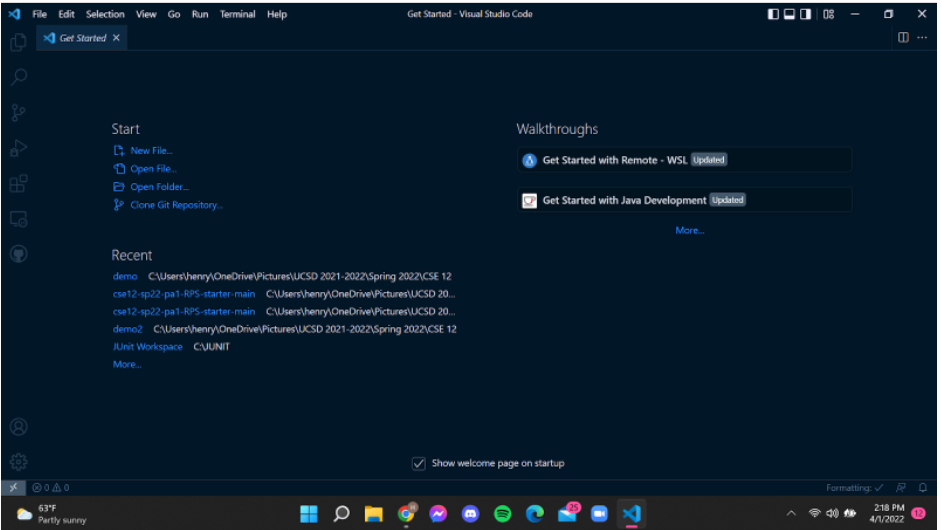
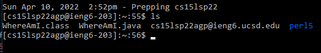

# Week 2: Lab Report 1

## Installing Visual Studio Code

Visual Studio Code is a source code editor. Source code editors allow for easy writing and reading of code. Visual Studio Code can be downloaded from [https://code.visualstudio.com/](https://code.visualstudio.com/).

## Remotely Connecting

To remotely connect to UCSD's servers, perform the following steps:

1. Install OpenSSH
2. Look up CSE15L account
3. Use the command ssh cs15lsp22agp@ieng6.ucsd.edu to login to UCSD's server

A successful login looks like the following:

## Trying Some Commands

Some of the commands ran and their functionalities were:

- ls: lists the files in the working directory
- cd: changes the working directory into the specified directory
- pwd: prints the working directory
- cp: makes a copy of the specified file
- mkdir: creates a new directory with the directory name after
- rm -r: removes the directory named at the end of the command
- exit: terminates the remote session

An example of the ls command is as follows:

## Moving Files with scp

The command scp is used to move files from the local machine to the remote server.

A successful copy of the files from the local machine copied to the remote server looks as follows:

The file was successfully transferred from the local machine:

The file shows up in our remote server's directory:

The difference in output when running commands in ssh versus the local computer is the working directory path. In the local computer, the user is "henry". When working in the remote server, the user is "cs15lsp22apg@ieng6-201".

Entering the password for each time a file is copied over is also quite tedious and takes me a couple of minutes.

## Setting an SSH Key

SSH keys allow for our computers to store private and public keys that allow us to use files as our passwords. This helps to save users' time by not having to enter their passwords each time when connecting remotely or copying over files. This solution uses a program called ssh-keygen. A private and public key are generated on the local computer. The public key is copied over to the remote server.

Steps to set up an SSH key:

1. On your own computer (not the remote connection) enter ssh-keygen
2. When prompted to enter a passphrase, hit enter (x2)
3. Copy over the public key stored in the .ssh directory in your computer onto the server
4. On the server, create a .ssh directory using mkdir .ssh and then logout
5. On your own computer, copy the public key into the .ssh directory on the server using scp

A successful login without having to use a password is as follows:

This can now save the user a lot of time. Previously, we saw that copying numerous files could be a time intensive task. Now, with public keys, the time spent copying files and logging in is significantly expedited.

## Optimizing Remote Running

Multiple terminal commands can also be written on the same line to save time and for convenience. This is done by using quotes on commands following the ssh command. Semicolons between multiple commands is another viable option. Using the up-arrow key on the user's keyboard also allows for quick and easy access to previous terminal commands.

Below is an example of performing the ssh, javac, and java commands all in the same line in the terminal. This line of code creates the remote connection to a UCSD server, compiles WhereAmI.java, and then runs WhereAmI.java.

