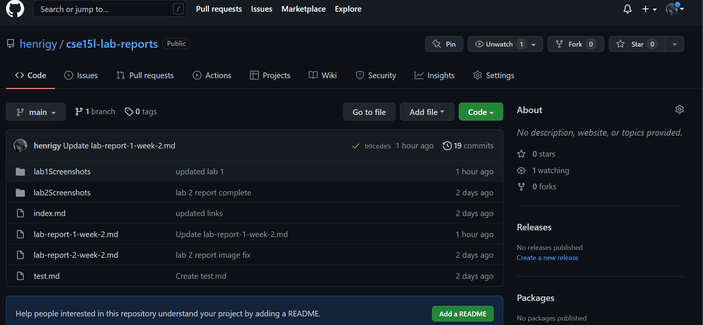
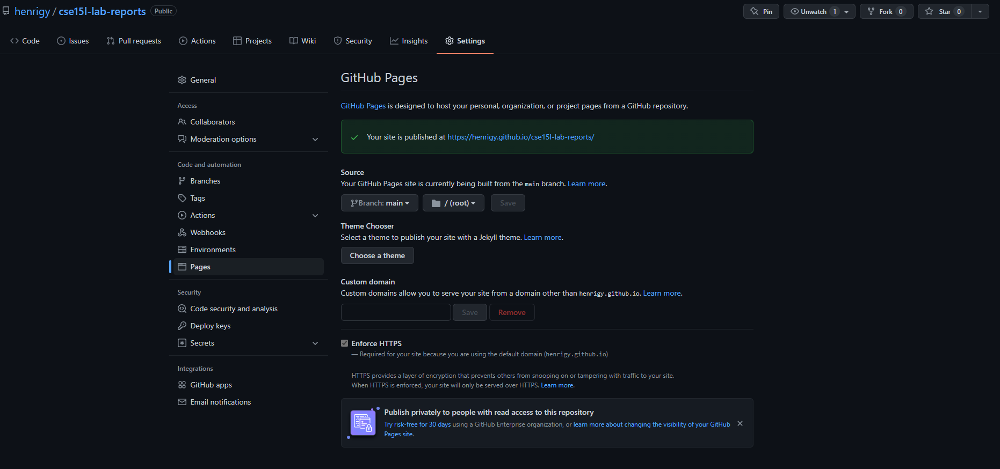
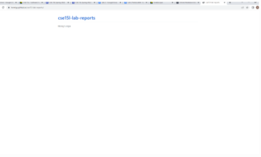
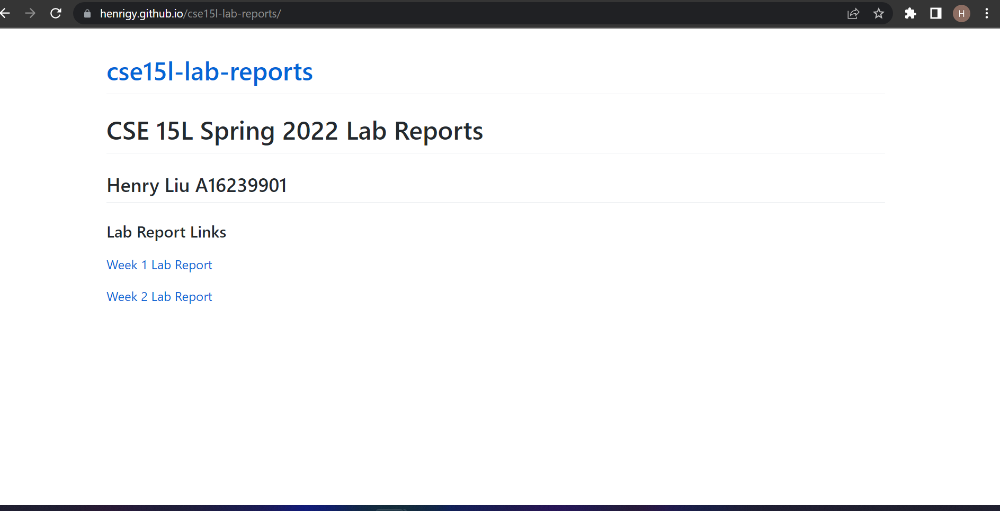
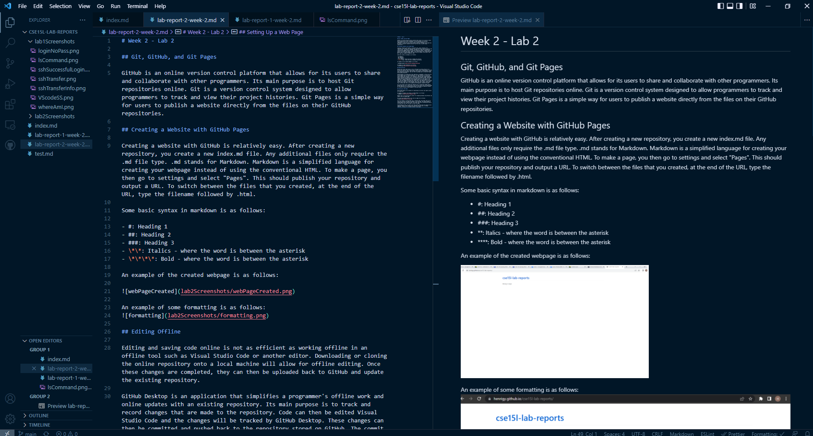
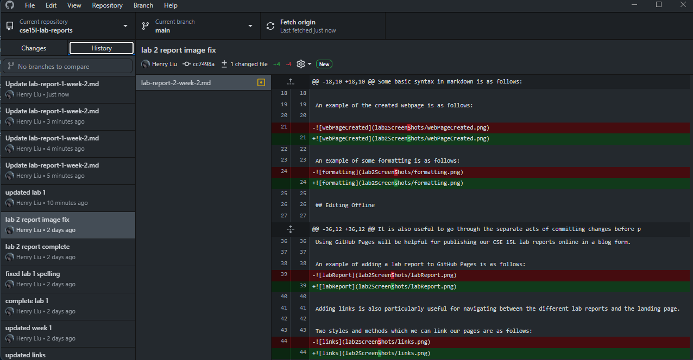
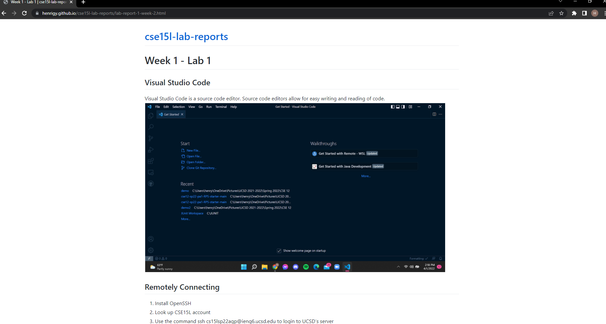
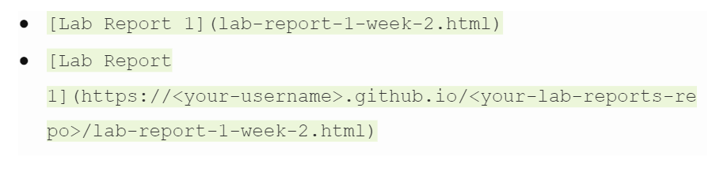

# Week 2 - Lab 2

## Git, GitHub, and Git Pages

GitHub is an online version control platform that allows for its users to share and collaborate with other programmers. Its main purpose is to host Git repositories online. Git is a version control system designed to allow programmers to track and view their project histories. Git Pages is a simple way for users to publish a website directly from the files on their GitHub repositories.

This is the GitHub repository for this web page!

This is where you can create a GitHub Page!

## Creating a Website with GitHub Pages

Creating a website with GitHub is relatively easy. After creating a new repository, you create a new index.md file. Any additional files only require the .md file type. .md stands for Markdown. Markdown is a simplified language for creating your webpage instead of using the conventional HTML. To make a page, you then go to settings and select "Pages". This should publish your repository and output a URL. To switch between the files that you created, at the end of the URL, type the filename followed by .html.

Some basic syntax in markdown is as follows:

- #: Heading 1
- ##: Heading 2
- ###: Heading 3
- \*\*: Italics - where the word is between the asterisk
- \*\*\*\*: Bold - where the word is between the asterisk

An example of the created webpage is as follows:

An example of some formatting is as follows:

## Editing Offline

Editing and saving code online is not as efficient as working offline in an offline tool such as Visual Studio Code or another editor. Downloading or cloning the online repository onto a local machine will allow for offline editing. Once these changes are completed, they can then be uploaded back to GitHub and update the existing repository.

GitHub Desktop is an application that simplifies a programmer's offline work and online updates with an existing repository. Its main purpose is to track and record changes that are made to the repository. Code can then be edited Visual Studio Code and the changes will be tracked by GitHub Desktop. These changes can then be committed and pushed back to the repository stored on GitHub. The commit command saves the changes made offline and saves them to a local copy of the repository. Comments regarding the new changes made can also be added at this step. The push command then saves the remote copy of the repository on the online repository on GitHub. On GitHub Desktop, you'll see "Push Origin". Origin refers to the remote repository or the original repository that a project was cloned from. In this case, this is the repository we originally created on GitHub.

It is also useful to go through the separate acts of committing changes before pushing them just for a final check of the files and which files are being pushed to the repository. For collaborative-projects, this would be especially helpful for trying to minimize faulty updates to the main branch.

Editing offline using Visual Studio Code looks like the following:

There is a markdown preview on the right that makes it convenient to instantly see the changes and updates being made to a markdown file.

GitHub Desktop is another useful tool used in conjunction with Visual Studio Code to quickly download code from a repository and to upload any changes.

## Setting Up a Web Page

Using GitHub Pages will be helpful for publishing our CSE 15L lab reports online in a blog form.

An example of adding a lab report to GitHub Pages is as follows:

Adding links is also particularly useful for navigating between the different lab reports and the landing page.

Two styles and methods which we can link our pages are as follows:

The first method of linking pages uses a relative path. This means that we are using the existing file path to navigate to the new page. The second method of linking pages uses an absolute path. This means that we are resetting the entire file path with this new file path to access the page.

From Markdown preview, we cannot view these pages because the file paths are not complete. However, when viewing from a browser, the file path is already completed, allowing us to navigate between linked pages.
