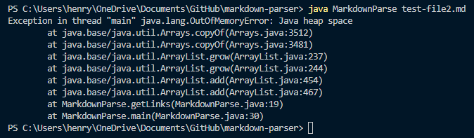
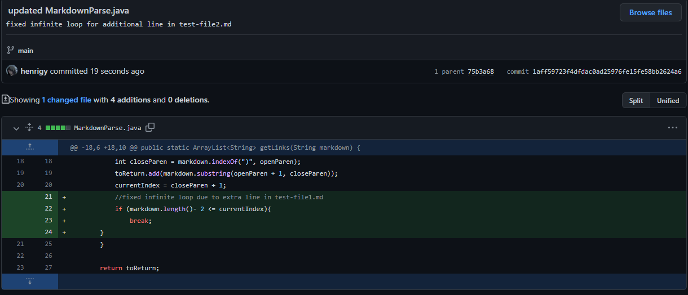
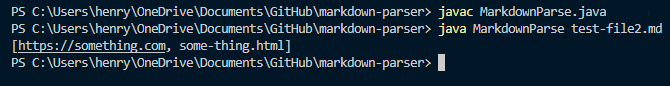
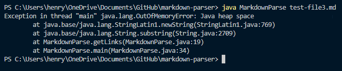
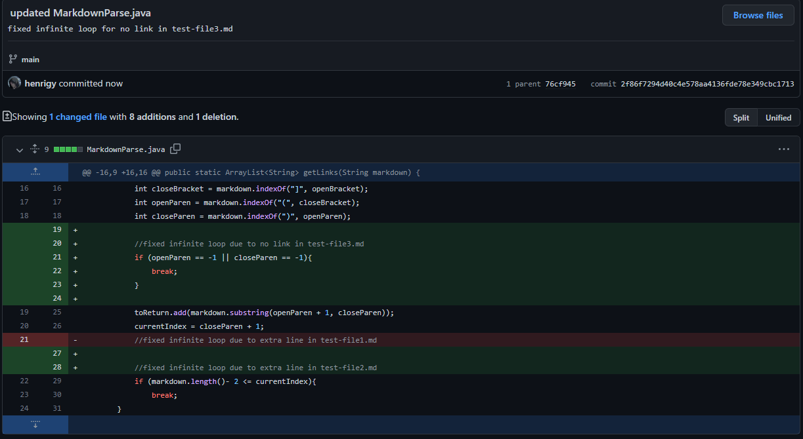
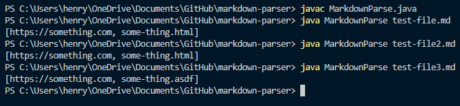
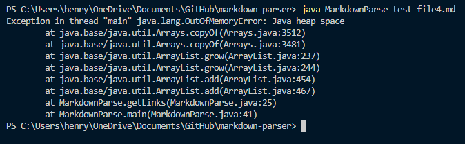
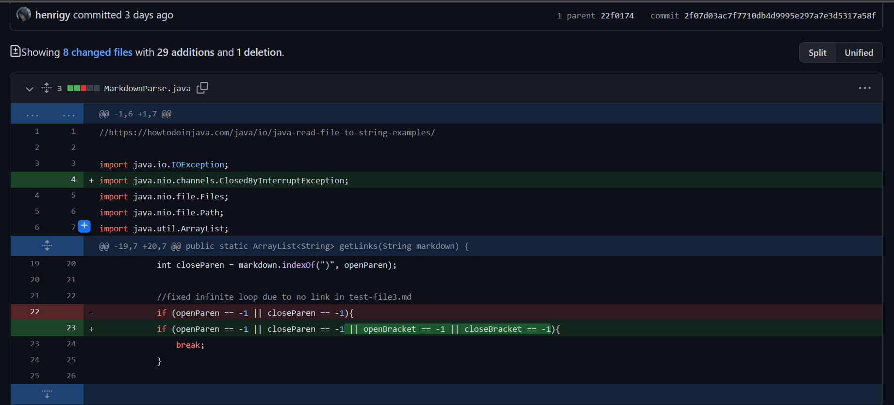
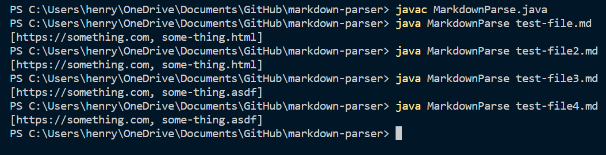

# Week 4: Lab Report 2

## Incremental Development Programming
In programming, incremental development is a programming method emphasizing the repeated cycle of coding and testing every 10-15 lines of code.

This allows for programmers to catch mistakes in their code quickly and when the code is still early in its development. Programmers should always thoroughly test their code and to find ways to break their code.

From ["How to Debug"](https://blog.regehr.org/archives/199), two important terms in debugging code are the following:
- Symptom: "a faulty program behavior that you can see, such as crashing or producing the wrong answer"
- Bug: "a flaw in a computer system that have zero or more symptoms"
- Failure-Inducing Input: "input to the program that causes the bug to execute and symptoms to appear. In some cases, capturing the complete failure-inducing input is hard because it may include window system events, hardware-level events like interrupts or bit-flips in RAM cells, and OS-level events like context switches and TCP timeouts. The times at which elements of the input occur may be important"

## Finding A Breaking Test
In Lab 3, we were tasked with designing test files that would break the Markdown parser program that we forked from [https://github.com/nidhidhamnani/markdown-parser](https://github.com/nidhidhamnani/markdown-parser).

### Test 1:
In the [first breaking test file](https://github.com/henrigy/markdown-parser/commit/75b3a682c274fe986d6a260f09a463bb7ce7a739), our failure-inducing input was an extra line added to the end of the Markdown file. The symptom was not having the correct output printed out and receiving an error with heap space. The bug was an infinite loop from MarkdownParse.java's while loop caused by missing open and closed parentheses and brackets.

The command line error:

To fix this issue, we added a conditional for when the currentIndex is within a certain range of markdown.length() to break out of the while loop. This helps solve the issue of the program not having a condition to handle when the currentIndex is on an empty line.

The updated MarkdownParse.java:

The working command line for this breaking test and previous files:

;

### Test 2:
In the [second breaking test file](https://github.com/henrigy/markdown-parser/commit/76cf945592be8639a387d57dae45db7684e336f2), our failure-inducing input was leaving out the link for a given title in the Markdown file. The symptom was not having the correct output printed out and receiving an error with heap space. The bug was an infinite loop from MarkdownParse.java's while loop caused by missing open and closed parentheses.

The command line error:

To fix this issue, we added a conditional to break out of the while loop when the next set of closed and open parentheses could not be located on the file. This helped solve the issue of the program not having a condition to handle when there was no next link to look for and add to the output string. We would simply skip to the next line and look for the next title and link pair.

The updated MarkdownParse.java

The working command line for this breaking test and previous files:

;

### Test 3:
In the [third breaking test file](https://github.com/henrigy/markdown-parser/commit/287dad48c71d1277d98c2d39915a3cfc0dce60ef), our failure-inducing input was leaving out the title for a given link in the Markdown file. The symptom was not having the correct output printed out - where we only print out the first two valid links - and receiving an error with heap space. The bug was an infinite loop from MarkdownParse.java's while loop caused by missing open and closed brackets.

The command line error:

To fix this issue, we added to the conditional statement we created from the previous iteration of our MarkdownParse.java to break out of the while loop if the next set of closed and open brackets or parentheses could not be found. This is because a link with no title is an invalid link in Markdown. When this was the case we would like to stop looking for the next set of parentheses or brackets as this is at the end of the Markdown file. The link with no title does not need to be added to the output string.

The updated MarkdownParse.java

The working command line for this breaking test and previous files:

