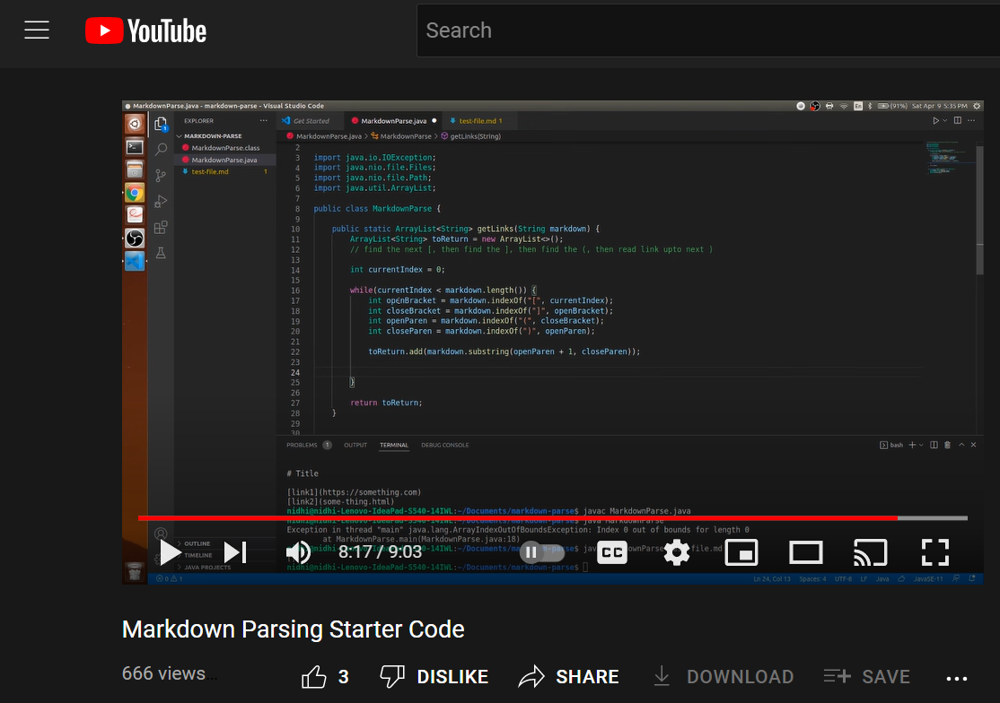
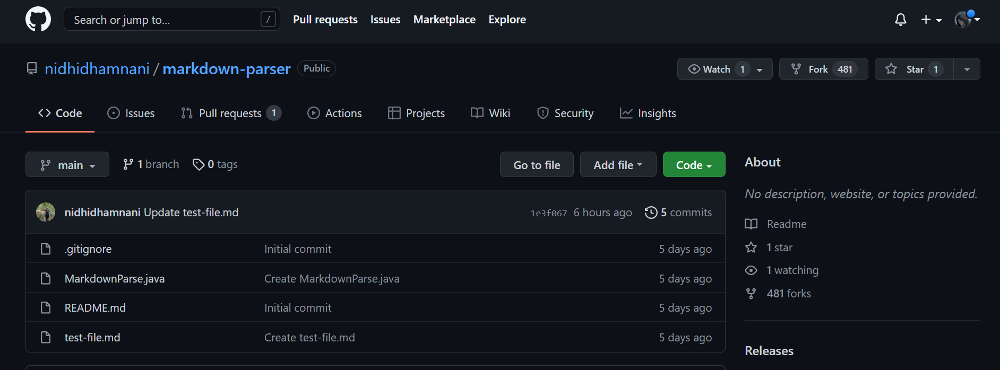
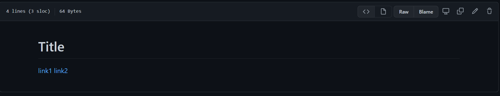
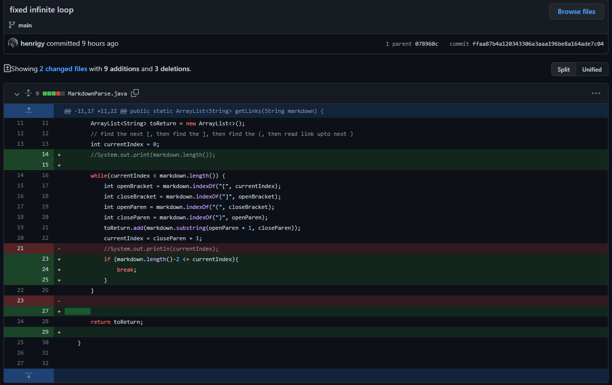
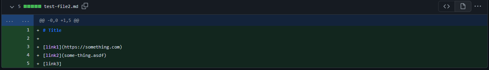
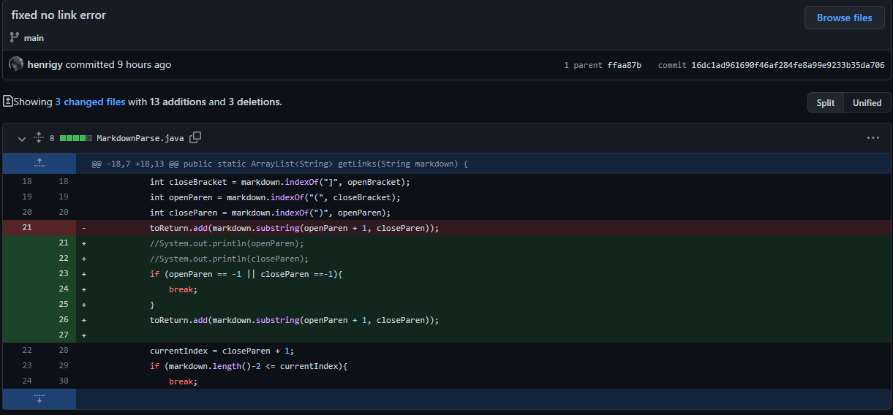
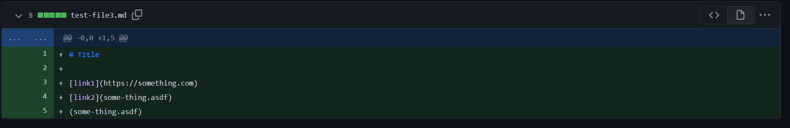
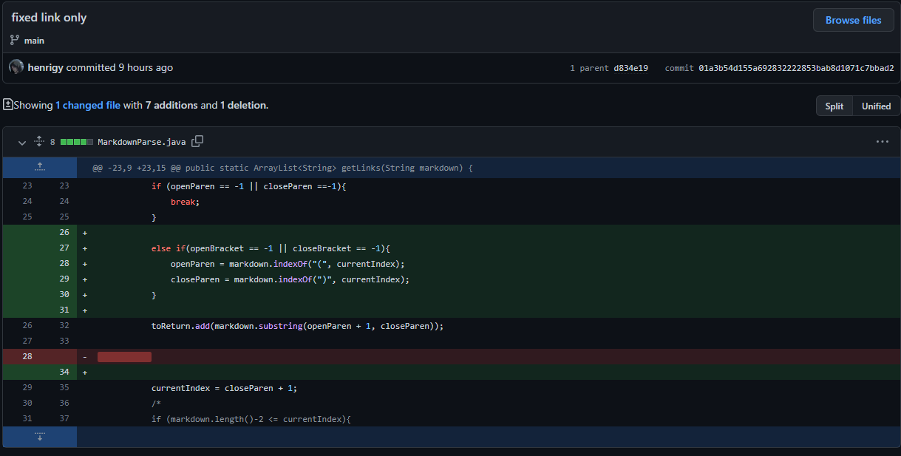

# Week 3 - Lab 3

## Pair Programming

Pair programming is a software development technique where two individuals code together on the same workstation. Usually, one individual will do the coding while the other watches and gives suggestions and advice. Some common and courteous pair programming norms that should be practiced and implemented include:

- Not being a backseat driver
- To not be bossy
- Switch roles often
- Make suggestions ahead of time
- Do not insult your partner

## Getting Started
When programming, it is quite common to look up things on the internet. Programmers should not be afraid to use the internet as a resource. Just make sure to cite your sources! 

When watching the YouTube video [Markdown Parsing Starter Code](https://www.youtube.com/watch?v=k67e-Icw4ug), we kept track of some of the following statistics:

- The programmer use the internet once to look up information pertaining to the program being coded.
- The programmer writes about 10-13 lines of code between runs of the program.
- The programmer uses autocomplete once or twice every line (using tab). This would help avoid a typo in every single line of code with a variable name in it. This would especially helpful for variables that are similar in name and spelling.

## Getting and Running the Code

Creating a fork in GitHub allows for programmers to create a copy of a remote repository on your local machine without impacting the remote or parent repository. This allows for programmers to freely experiment with changes without affect the remote repository. 

Forking the repository should and can be done using GitHub Desktop and opened in Visual Studio Code.

In this lab, we forked a repository that parses Markdown files and lists the links that were contained in the file.

After running javac MarkdownParse.java and java MarkdownParse test-file.md on our forked repository, we found the following:
- The 3 different currentIndex values are 0, 41, and 67.
- The purpose of the second argument to indexOf is to specify the index for a desired character. Without it, the while loop would constantly search from the start of the string and not increment the location of the parentheses and the brackets.

## Finding a Breaking Test

Programmers should always thoroughly test their code and to find ways to break their code. This repeated process helps programmers continually improve their code and to increase their efficiency. 

The forked repository and its code are not implemented to perfection. One case that we found to break the coded was when there is an extra line at the end of the Markdown file. 

We then committed this file that breaks this code. Making a commit with a file that breaks the code will be helpful for future debugging and to suggest edits to the remote repository's owner. It would help a staff member who is reviewing the original code to quickly reference the test case that is not working. So, in summary, it will help speed up the efficiency of debugging code, compile test files that break the code and so that corrections can be made quickly, and submitting to a public forum such as GitHub also allows for others to add their suggestions.

## Improving the Program

To fix the infinite loop, my pair programming partner Branden Sioson made the realization that the currentIndex would never increment to a value greater than the markdown.length(). To resolve this, we decided to create a conditional checking for if the currentIndex would be within a certain range of markdown.length(). If it was, then we would break out of the while loop to prevent an infinite loop. 

## Repeating the Process
Two additional test files that broke our code included the following:

A test file where a title had no link attached

This issue was resolved with a conditional that would break the while loop if the indices of the open and closed parentheses could not be found. This title's non-existent link would not be added to the list returned by the getLinks method.

A test file where a link had no associated title

This issue was resolved with another conditional that would change the indexOf starting index value to that of currentIndex if the indices of the open and closed square brackets could not be found. This link with no title would still be added to the returned array of links.

Some techniques we used to figure out how to fix the program were to analyze each line of code to find out, in depth, its meaning and functionality. This included searching the definition of indexOf and what is second argument's purpose was. to fix the case with no link, Brendan suggested that we just not add it. this would occur when the indexOf the open and closed parentheses would be equal to -1. When this happens we created a conditional that broke the while loop when this happened. As for when there was no title associated with a link, I created another conditional that found the index of the open and closed parentheses when the known index of the closed and open brackets as they would evaluate to -1.