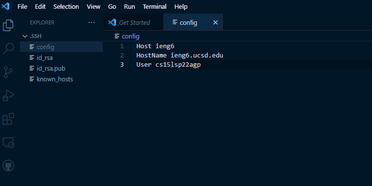
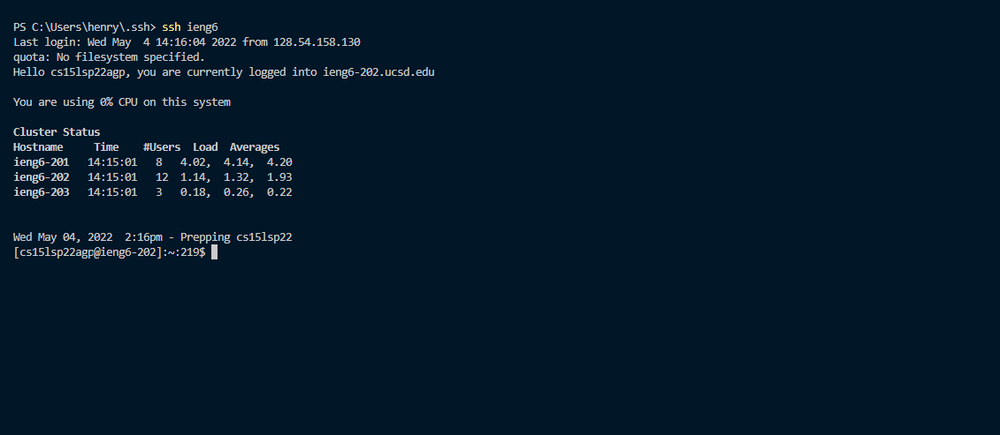
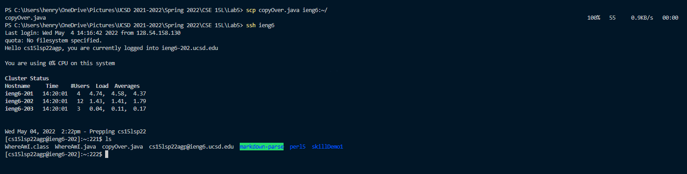
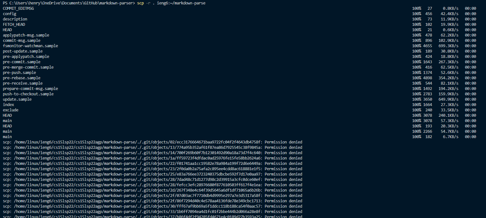
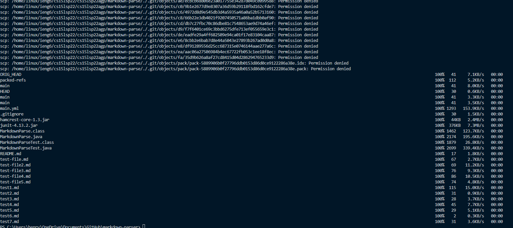
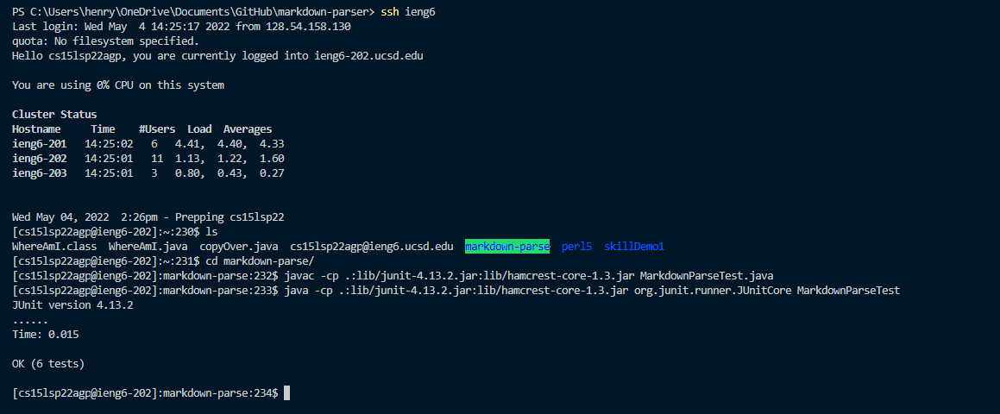

# Week 6: Lab Report 3

## Streamlining ssh Configuration
When logging into our remote server, we type the lines of the general form: "ssh cs15lsp22xxx@ieng.ucsd.edu". This process can be further streamlined though and save some typing! We can do so b saving our username with our public key that we already use instead of typing our password logging into our remote server.

My .ssh/config file and editing it via Visual Studio Code:

The ssh command logging me into my account using just the alias that I chose:

Using the scp command to copy over a file from my personal machien to my remote account using just the alias that I chose:

## Setup GitHub Access From ieng6

## Copy Whole Directories with scp -r
Copying over the whole markdown-parse directory to my ieng6 account:

Logging into my ieng6 account after copying over the entire directory and compiling and running the tests for my markdown-parse repository:

Combining scp, ;, and ssh to copy over the whole directory and run the tests in one line:

