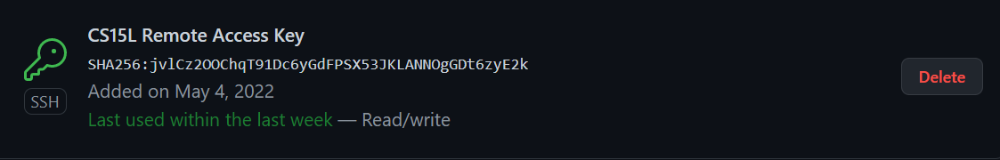

# Week 6: Lab Report 3

## Streamlining ssh Configuration
When logging into our remote server, we type the lines of the general form: "ssh cs15lsp22xxx@ieng.ucsd.edu". This process can be further streamlined though and save some typing! We can do so b saving our username with our public key that we already use instead of typing our password logging into our remote server.

My .ssh/config file and editing it via Visual Studio Code:

The ssh command logging me into my account using just the alias that I chose:

Using the scp command to copy over a file from my personal machine to my remote account using just the alias that I chose:

## Setup GitHub Access From ieng6
For adding, committing, and pushing to GitHub, this operation no longer accepts manual password inputs. As per the update, it requires that this process be done using a public access key. This also saves time in inputting usernames and passwords as the public access key will be stored on both the remote server and on my GitHub account.

Storing public key on GitHub:

Storing public (id_rsa.pub) and private (id_rsa) keys in user account:

Running git commands to commit and push a change to GitHub while logged into my ieng6 account:

Link for the resulting commit: [https://github.com/henrigy/labReport3Demo/commit/36385ac9e6195cb25f17a3516acab3d2604eb51e](https://github.com/henrigy/labReport3Demo/commit/36385ac9e6195cb25f17a3516acab3d2604eb51e)

## Copy Whole Directories with scp -r
Previously, we only learned that the scp command can copy individual files at a time over to our remote account. However, with scp -r, we can copy entire directories over in one command. This saves both time and the amount of copying that we would have to do if we wanted to copy multiple files from the same folder.

Copying over the whole markdown-parse directory to my ieng6 account:

Logging into my ieng6 account after copying over the entire directory and compiling and running the tests for my markdown-parse repository:

Combining scp, ;, and ssh to copy over the whole directory and run the tests in one line:

