# Week 8: Lab Report 4
## My Own Implementation of Markdown-Parse
My own implementation of Markdown-Parse: [https://github.com/henrigy/markdown-parser](https://github.com/henrigy/markdown-parser)

## Another Implementation of Markdown-Parse
Katieki's implementation of Markdown-Parse: [https://github.com/katieki/markdown-parser](https://github.com/katieki/markdown-parser)

## Expected Results
For this lab write-up, we will be adding 3 additional test files that we will be running the implementations of Markdown-Parse against.

### Snippet #1:

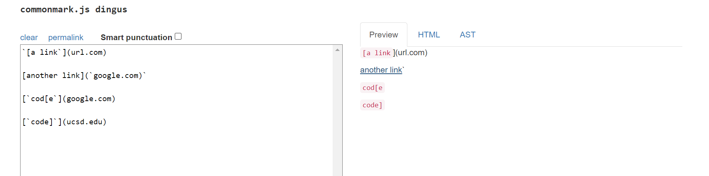

Expected Results for Snippet #1: ['google.com]

### Snippet #2:

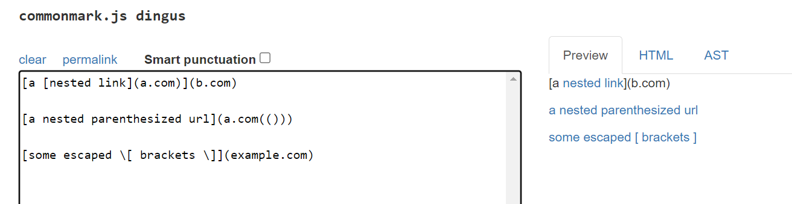

Expected Results for Snippet #2: [a.com, a.com(()), example.com]

### Snippet #3:

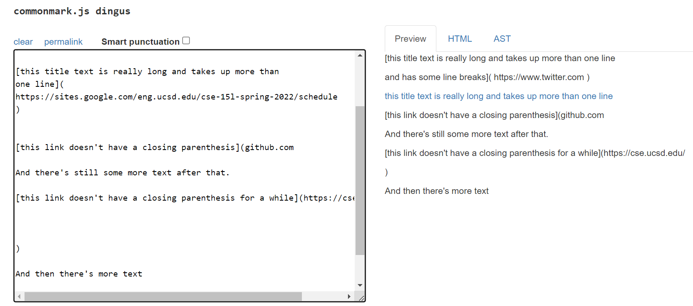

Expected Results for Snippet #3: [https://sites.google.com/eng.ucsd.edu/cse-15l-spring-2022/schedule]

## Turning the Test Files into JUnit Tests
There will be a total of 6 added test methods added. 3 for my MarkdownParse repository and 3 to Katieki's cloned MarkdownParse repository. The 3 statements being written for each repository will be of the following form:

### Snippet #1 Test

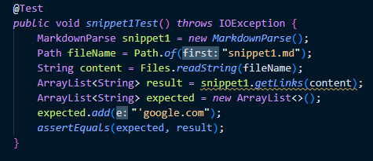

### Snippet #2 Test

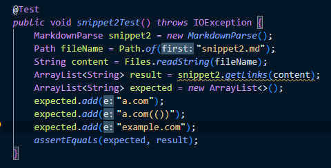

### Snippet #3 Test

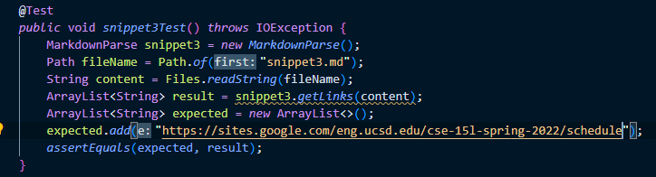

## Test Results for My Own Implementation of Markdown-Parse

All three test cases for snippet1.md, snippet2.md, and snippet3.md failed. My MarkdownParse.java did not produce the expected outputs.

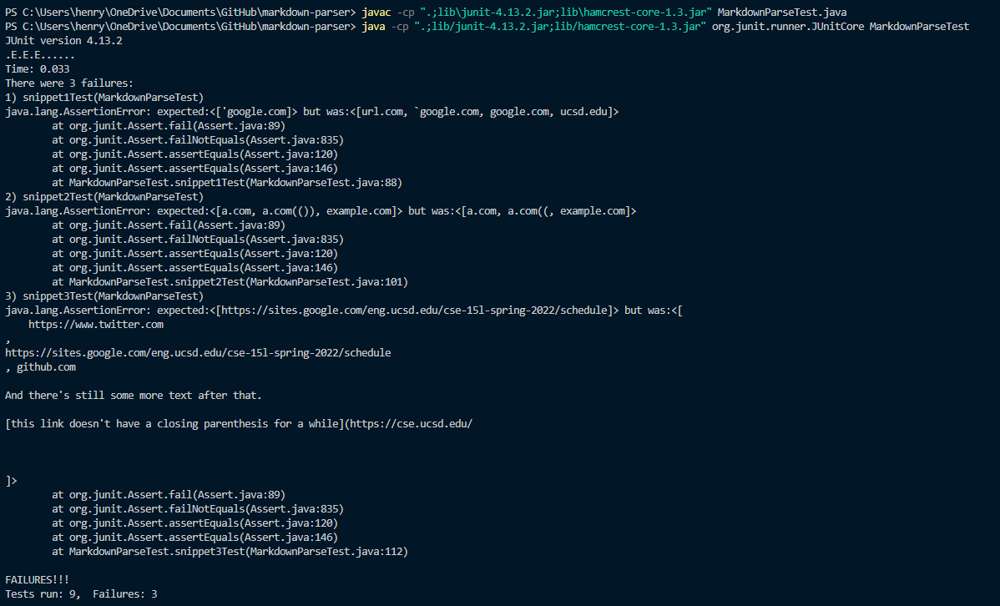

### Test Output for snippet1.md
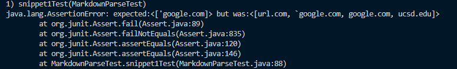

The test failed. Our version of MarkdownParse.java's output does not match our expected results for snippet1.md: ['google.com]. Instead, it outputs [url.com, 'google.com, google.com, ucsd.edu].

### Test Output for snippet2.md
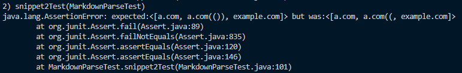

The test failed. Our version of MarkdownParse.java's output does not match our expected results for snippet2.md: [a.com, a.com(()), example.com]. Instead, it outputs [a.com, a.com((, example.com].

### Test Output for snippet3.md
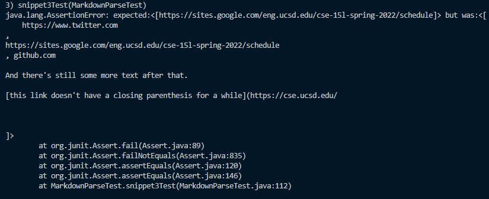

The test failed. Our version of MarkdownParse.java's output does not match our expected results for snippet3.md: [https://sites.google.com/eng.ucsd.edu/cse-15l-spring-2022/schedule]. Instead, it outputs [    https://www.twitter.com
, 
https://sites.google.com/eng.ucsd.edu/cse-15l-spring-2022/schedule
, https://cse.ucsd.edu/

].

## Test Results for Another Implementation of Markdown-Parse
All three test cases for snippet1.md, snippet2.md, and snippet3.md failed. My MarkdownParse.java did not produce the expected outputs.

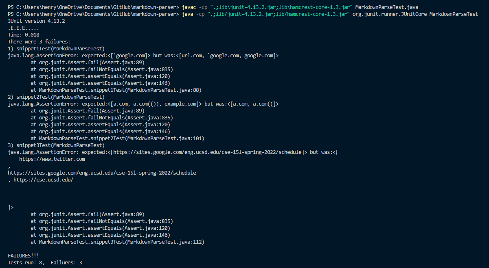

### Test Output for snippet1.md

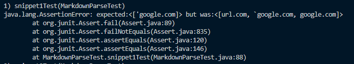

The test failed. Their version of MarkdownParse.java's output does not match our expected results for snippet1.md: ['google.com]. Instead, it outputs [url.com, 'google.com, google.com].

### Test Output for snippet2.md

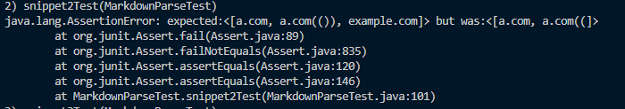

The test failed. Their version of MarkdownParse.java's output does not match our expected results for snippet2.md: [a.com, a.com(()), example.com]. Instead, it outputs [a.com, a.com((].

### Test Output for snippet3.md

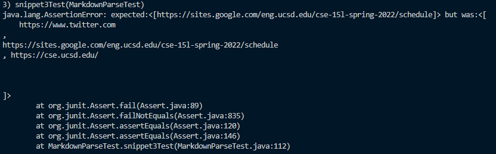

The test failed. Their version of MarkdownParse.java's output does not match our expected results for snippet3.md: [https://sites.google.com/eng.ucsd.edu/cse-15l-spring-2022/schedule]. Instead, it outputs [    https://www.twitter.com
, 
https://sites.google.com/eng.ucsd.edu/cse-15l-spring-2022/schedule
, https://cse.ucsd.edu/

].

## Future Changes for My Own Implementation of Markdown-Parse
### Changes to my Program to Handle Snippet #1:

In 10 lines or less, we can correct our version of MarkdownParse.java to address cases that use inline code with backticks. This can be quickly done by checking that the leading closed bracket does not have any characters before it using the indexOf method. As for the issue of the last two lines in snippet1.md, this can be addressed by creating two variables that count the number of open and closed brackets, respectively, for a given line in the markdown file. If the sum of the two variables is odd, then the link is invalid and should not be included in the output.

### Changes to my Program to Handle Snippet #2:

In 10 lines or less, we can correct our version of MarkdownParse.java to address cases that use nested parentheses, brackets, and escaped brackets by creating a counting algorithm similar to what was mentioned earlier except for open and closed parentheses to test if a link is valid. Two variables will count the number of open and closed parentheses respectively to test a valid link. If the sum is not even, then the link is not valid and should not be added to the output. However, if it is even, then the link is valid and should be added to the output.

### Changes to my Program to Handle Snippet #3:

I do not think that in 10 lines or less, we can correct our version of MarkdownParse.java to address cases that use newlines in brackets and parentheses. This is because handling the case for where there are line breaks for valid links is a much more involved change. I believe that there would need to be helper methods that can detect line breaks. Creating this helper method in addition to creating a condition detecting that a line break exists for a given link will take more than 10 lines of code to implement.
