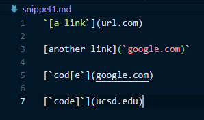
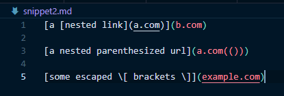
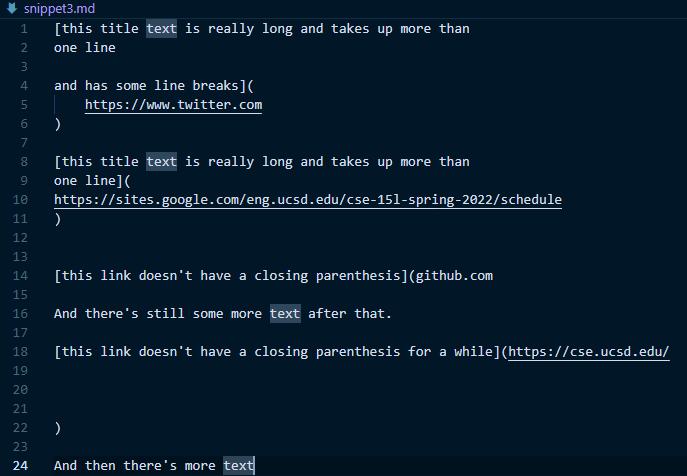

# Week 8: Lab Report 4
## My Own Implementation of Markdown-Parse
My own implementation of Markdown-Parse: [https://github.com/henrigy/markdown-parser](https://github.com/henrigy/markdown-parser)

## Another Implementation of Markdown-Parse
Katieki's implementation of Markdown-Parse: [https://github.com/katieki/markdown-parser](https://github.com/katieki/markdown-parser)

## Expected Results
For this lab write-up, we will be adding 3 additional test files that we will be running to implementations of Markdown-Parse against.

### Snippet #1:

Expected Results for Snippet #1: ['google.com]

### Snippet #2:

Expected Results for Snippet #2: [b.com, a.com(()), example.com]

### Snippet #3:

Expected Results for Snippet #3: [ ]

## Turning the Test Files into JUnit Tests
Snippet #1 Test

Snippet #2 Test

Snippet #3 Test

## Test Results for My Own Implementation of Markdown-Parse

## Test Results for Another Impelementation of Markdown-Parse

## Future Changes for My Own Implementation of Markdown-Parse
Changes to my Program to Handle Snippet #1:

Changes to my Program to Handle Snippet #2:

Changes to my Program to Handle Snippet #3: