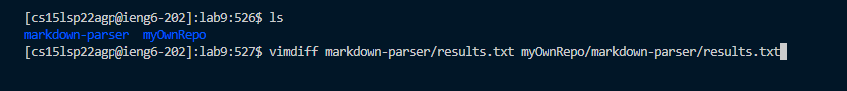
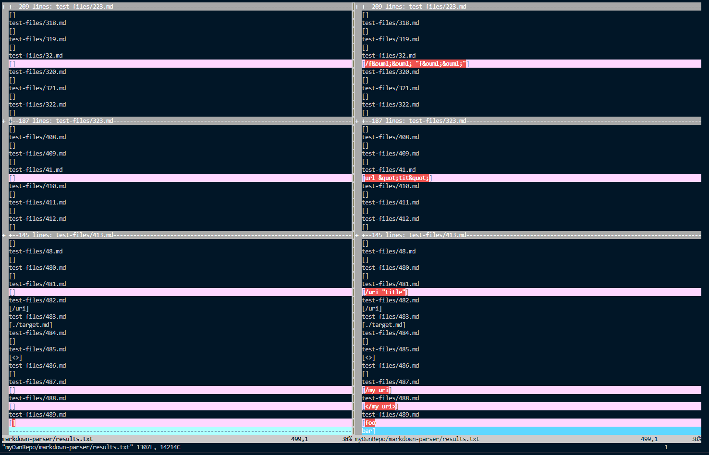
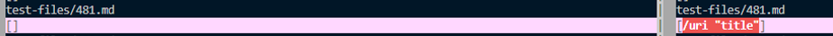
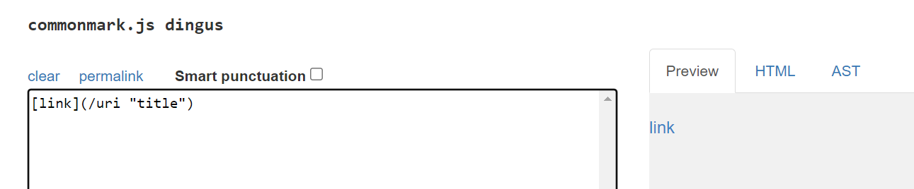
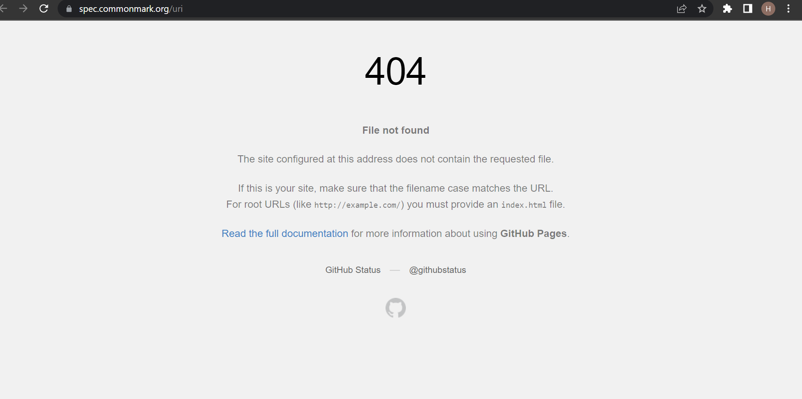
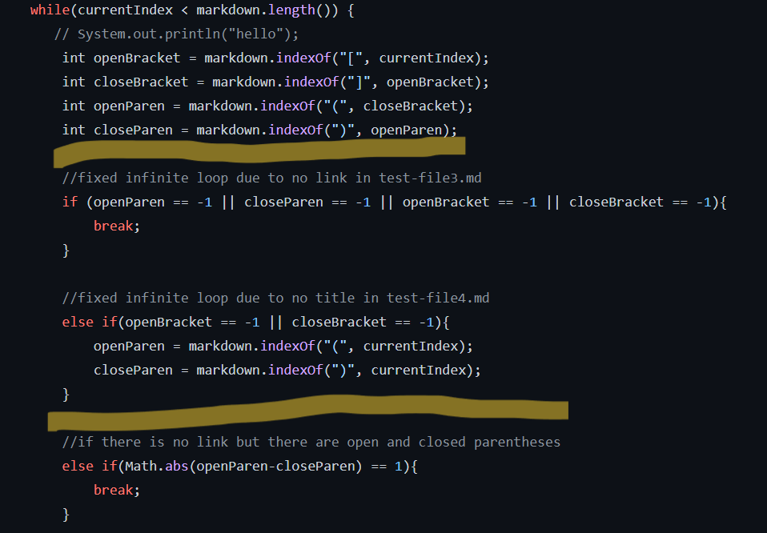
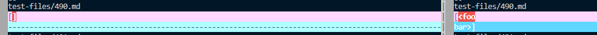
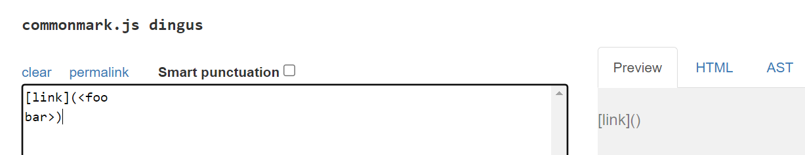
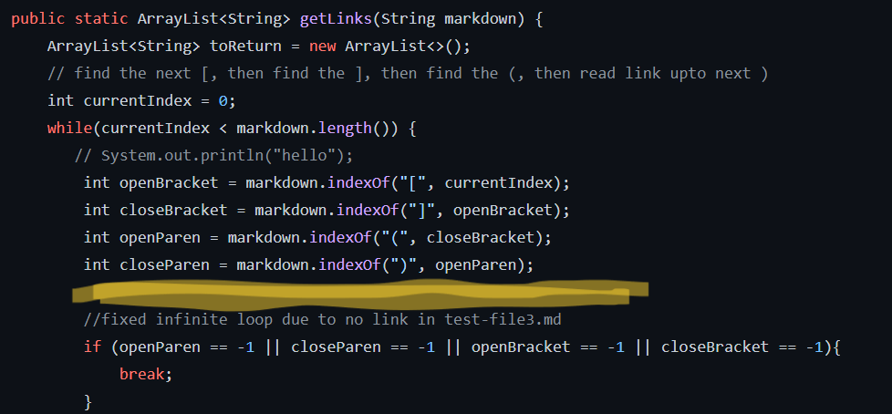

# Week 10: Lab Report 5
## Using vimdiff
Using the command vimdiff, we were able to compare the two repositories' result.txt files to quickly spot any differences in outputs.

The highlighted rows identifies where the two files have differences. I then scrolled through the output to see where the differences were. For this lab report, we will be working with test files 481.md and 490.md.
;

## Difference #1: 481.md
[https://github.com/nidhidhamnani/markdown-parser/blob/main/test-files/481.md](https://github.com/nidhidhamnani/markdown-parser/blob/main/test-files/481.md)

Neither implementation of MarkdownParse.java is correct. The expected output is [uri].

Putting the contents of 481.md into [the CommonMark demo site](https://spec.commonmark.org/dingus/), we get the following results: 

After clicking on the link generated in "Preview", we see that the url takes in only uri as the valid link even though "/uri 'title'" is all in the parentheses.

The bug for both implementations is that the programs do not but should take into account that words following a forward slash are valid links. However, this does not apply to multiple words following a forward slash. There can only be one word following the forward slash for the link to be valid unless it is in quotations like this test file.

The fix in my version of MarkdownParse.java should be made here:

I would need to create an additional variable and condition looking for the forward slash using indexOf() and checking for when the next space is. These lines of code would go where the yellow highlights in the above screenshot are. The value stored in the variable tracking the forward slash would also need to compare its value to the previous open parenthesis and next closed parenthesis.

## Difference #2: 489.md
[https://github.com/nidhidhamnani/markdown-parser/blob/main/test-files/490.md](https://github.com/nidhidhamnani/markdown-parser/blob/main/test-files/490.md)

The markdown-parser repository that we were provided has the correct implementation for test file 490.md. The expected output is [].

Putting the contents of 490.md into [the CommonMark demo site](https://spec.commonmark.org/dingus/), we get the following results: 

In the "Preview", we can see that there is no a valid link provided in test file 490.md.

The bug for my implementation is that valid links should not just be the all the contents between the open parenthesis and the next closed parenthesis. There needs to be a check that the contents between a set of parentheses do not skip lines.

The fix in my version of MarkdownParse.java should be made here:

The fix for my markdown-parser is to create a helper method that can detect when the index has been updated to a new line. Then, I would add another conditional that checks if a new line is contained between a pair of open and closed parentheses. These lines of code would go where the yellow highlight in the above screenshot is.

